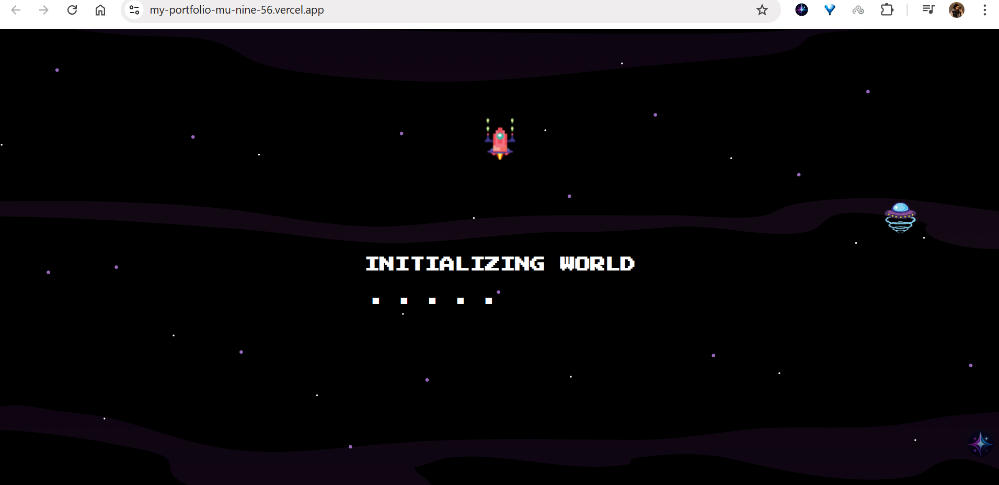
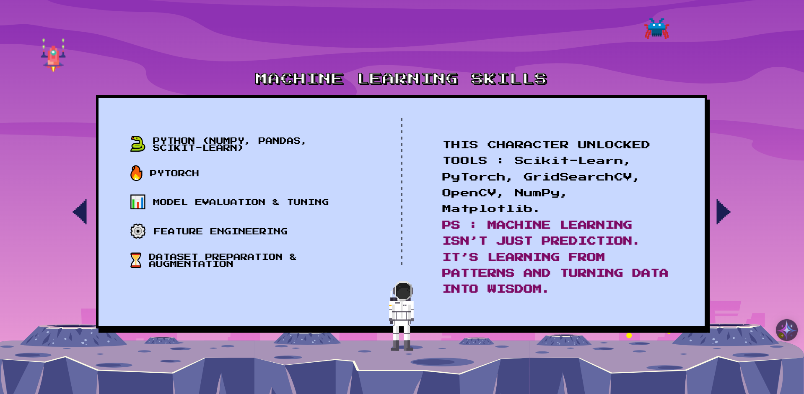

# Retro-Themed Portfolio

This portfolio is not just a collection of projects and skills—it’s a playful experience! You can navigate it like a retro game, progressing through levels filled with animations, sounds, and pixel art. Or, if you prefer, you can jump straight to a quick résumé view for a faster look at the essentials.

The design draws inspiration from classic 8-bit RPG games and a beautiful Figma concept by [Jayendra AWASTHI](https://www.figma.com/@Jayendra), blending nostalgia with modern web technologies to create a unique storytelling journey through a developer’s career.

You can try it online [here](https://my-portfolio-mu-nine-56.vercel.app/)
---

##  Features

- 🎮 **Start Screen**: Game-style entry screen with "Press Start" interaction.
- 🌌 **Animated Transitions**: Between each level, with space-like whoosh sounds.
- 👾 **Level System**:
  - **Level 0**: Intro screen (Portfolio cover).
  - **Level 1**: About Me 
  - **Level 2**: My Skills — with interactive arrows to browse skill pages.
  - **Level 3**: Project Showcase — each project shown like a power-up.
- **Pixel Art & Game UI**: All elements styled like a retro RPG.
-  **Sound Effects**: Each interaction is paired with sound (arrow click, transitions, etc).

---

##  Tech Stack

- **Frontend**: React + Vite  
- **Styling**: Tailwind CSS + custom CSS  
- **Animations**: Framer Motion  
- **Sound**: HTML5 Audio  
- **Design Style**: 8-bit / pixel-art inspired

---

##  Screenshots
### Introduction Screen

### Loading Screen

### Example of My Skills level

### My Projects Introduction

---

##  Install & Run

```bash
# Clone the repository
git clone https://github.com/ikramkdr/retro-portfolio.git
cd retro-portfolio

# Install dependencies
npm install

# Run the dev server
npm run dev
```

---


Made with ❤️ by [Ikram Kadri](https://github.com/ikramkdr)  
---

## License

This project is open-source under the MIT License.****
